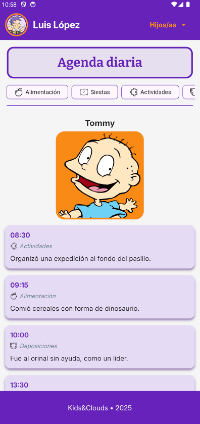
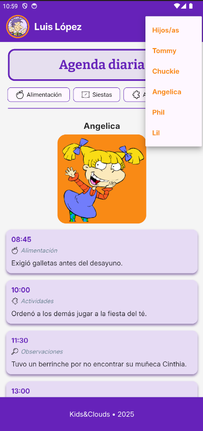
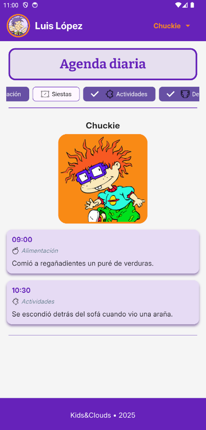

# 📝 Prueba técnica - Agenda Diaria  
Aplicación Flutter para el seguimiento diario de actividades infantiles

---

## 📌 Descripción del proyecto  
Agenda Diaria es una aplicación móvil desarrollada en Flutter como parte de una prueba técnica. Su propósito es permitir a los padres y tutores visualizar la agenda diaria de los niños, organizada por categorías como alimentación, siestas, actividades, deposiciones u observaciones.

---

## ✨ Funcionalidades principales  
- 👶 Visualización de eventos por niño y por categoría  
- 🔽 Selector de hijo/a desde la parte superior de la pantalla  
- 🏷️ Filtros por categorías mediante chips con selección múltiple  
- 🎨 Presentación visual clara y colorida  
- 📺 Personajes inspirados en la serie animada “Rugrats”, para dar un toque simpático y reconocible

---

## 🔧 Enfoque del desarrollo  
Mi enfoque ha sido crear una aplicación funcional y visualmente agradable, centrada en la simplicidad de uso y la claridad de la información.  
Además, he procurado que la paleta de colores y las tipografías se inspiren en el estilo visual de la web de la empresa, con el objetivo de mantener coherencia estética y alineación con su identidad corporativa.  

He optado por una arquitectura modular, separando widgets y manteniendo un código limpio y fácil de escalar.  
La interfaz está pensada para ser amigable y accesible, utilizando elementos como chips, avatares y listas agrupadas.  

Aunque se sugería obtener las imágenes desde una API externa, decidí utilizar `Image.asset` en lugar de `Image.network`, ya que las imágenes proporcionadas no resultaban especialmente atractivas y el número de recursos visuales necesarios era reducido. Esta decisión permite mantener el diseño más controlado y coherente con el estilo visual deseado.

Actualmente los datos son simulados, pero la estructura está preparada para una futura integración con bases de datos en la nube.

---

## 🚀 Instrucciones de instalación  
1. 💻 Instala Flutter (versión 3.0 o superior recomendada)  
2. 📂 Clona este repositorio en tu máquina local  
3. 🧰 Abre el proyecto con tu IDE (Android Studio, VS Code, etc)  
4. 🔄 Ejecuta `flutter pub get` para instalar las dependencias  
5. 📱 Conecta un emulador o un dispositivo físico  
6. ▶️ Ejecuta el proyecto con `flutter run`

---

## 👤 Autor  
Este proyecto ha sido desarrollado por **Fran González** como parte de una prueba técnica para un proceso de selección.

## 📷 Capturas de pantalla

| Pantalla principal | Selector de niño | Filtro por categorías |
|--------------------|------------------|------------------------|
|  |  |  |
